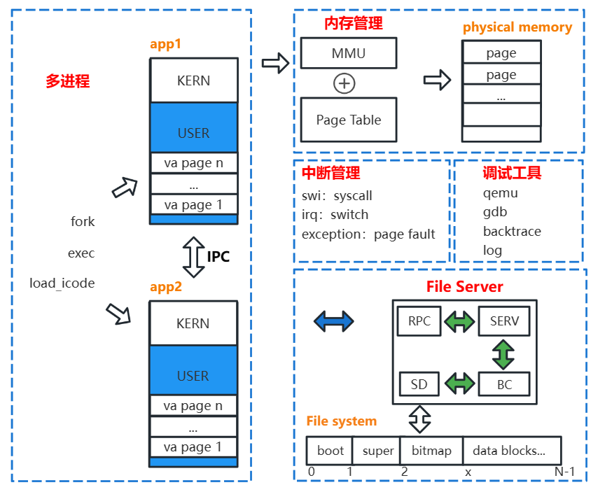

# xJOS
xJOS是基于ARMv7的微内核操作系统，是我在学习哈工大李治军老师的操作系统课程、MIT 6.828课程之后，借鉴Linux、freertos等内核，从零自制的一个操作系统。MIT课程的6个Lab和10个HW设计出了基于x86架构的JOS，本内核基于ARMv7架构，还具有详细说明设计思想和实现方法的图解文档，故项目取名xJOS。

## Features

目前已实现进程管理、内存管理、中断管理和文件系统等组件，已撰写说明设计思想和实现方法的图解文档。

1、内存管理：以页为单位管理**物理内存**，维护链表结构分配和释放内存；基于**多级页表**管理虚拟内存，实现内核与进程之间的隔离。

2、进程管理：**多进程**可从内核镜像加载，或使用exec从文件系统加载，也可通过fork拷贝父进程产生；设计**基于内存共享的IPC**机制，用于进程之间的通信。

3、中断管理：设计**Trapframe**保存上下文；管理软中断、外部中断和异常，分别用于实现系统调用、抢占式调度和写时复制；设计用户程序**回调函数**机制，实现user-level的页错误处理。

4、文件系统：借鉴linux驱动思想，设计设备驱动框架，提供同一套API访问不同设备；基于**微内核**思想设计File Server，实现**Block Cache**机制，进程通过RPC访问具有分层目录结构的文件系统。

5、调试工具：搭建qemu测试环境，利用qemu和gdb等工具调试内核；内核中实现了log和**backtrace**等调试内核与进程的工具，backtrace可回溯函数调用栈帧，并打印stab调试信息。

## Docs
[1 Boot imx6 in qemu](./docs/1%20Boot%20imx6%20in%20qemu.md)

[2 Memory management](./docs/2%20Memory%20management.md)

[3 Trap](./docs/3%20Trap.md)

[4 Multitasks](./docs/4%20Multitask.md)

[5 Device & File system](./docs/5%20Device%20%26%20File%20System.md)

